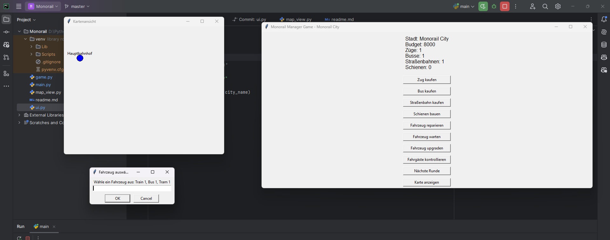
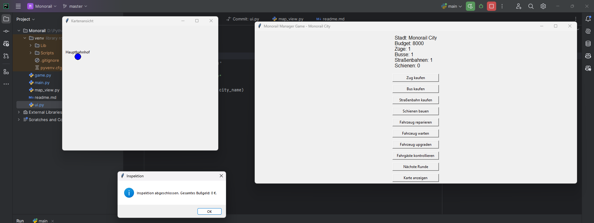
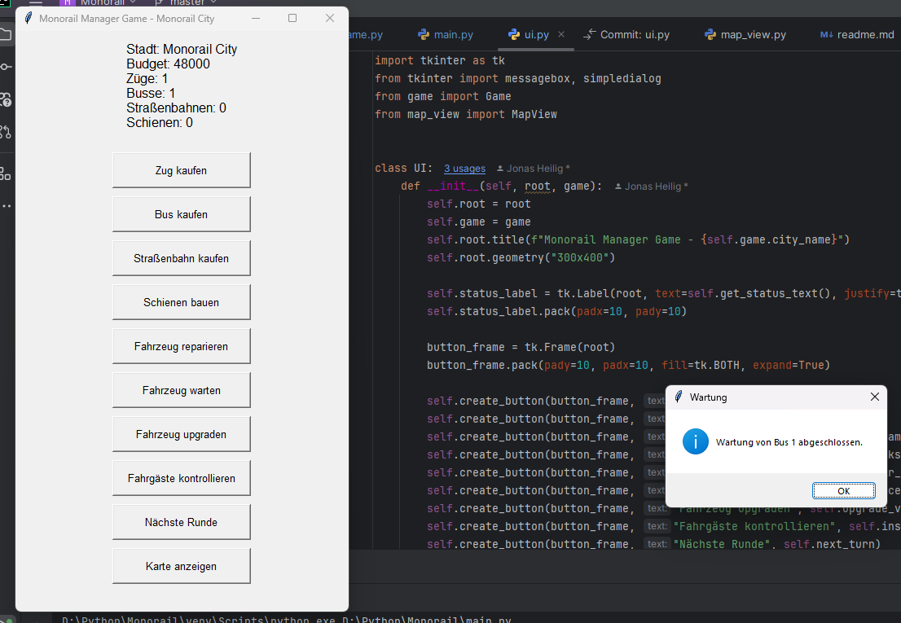

# Monorail Manager Game

## How to Start the Game
1. Clone the repository
2. Run the command `python main.py` in the terminal to start the game
3. The game will start.

# Disclaimer:
At the moment, is this game a Sandbox game with out story and many bugs. The game is still in development and will be updated in the future.

## How to Play the Game
1. The game is a sandbox game.
2. You can build tracks, and vehicles.
3. You can see all your Stations
4. You can see all repair, maintain, buy and Upgrade your vehicles.
5. Alot more.
6. Have fun with the demo

Previw of the game:

